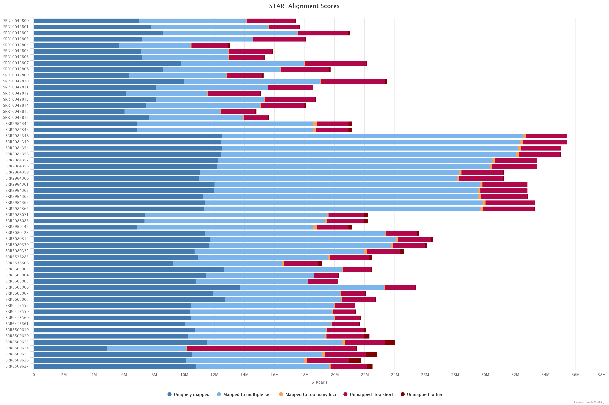

test
# Annotation


## Datasets

Raw RNAseq data was downloaded from NCBI, searching for the _Poa pratensis_, using the search term:`(((Poa pratensis[Organism]) AND "transcriptomic"[Source]) AND "illumina"[Platform]) AND "paired"[Layout]`. A total of 58 libraries, belonging to 7 different `BioProject`s were used as evidence set for gene prediction.

| Run         | AvgSpotLen | Bases      | BioProject  | BioSample    | Center Name                                                   | Consent | Experiment | geo_loc_name_country | Instrument          | LibraryLayout | LibrarySelection   | LibrarySource  | Organism      | dev_stage         | Cultivar   | Ecotype              | Treatment                           |
|-------------|------------|------------|-------------|--------------|---------------------------------------------------------------|---------|------------|----------------------|---------------------|---------------|--------------------|----------------|---------------|-------------------|------------|----------------------|-------------------------------------|
| SRR10042800 | 302        | 5270027142 | PRJNA562234 | SAMN12636565 | USDA-ARS                                                      | public  | SRX6777640 | USA                  | Illumina HiSeq 4000 | PAIRED        | RANDOM             | TRANSCRIPTOMIC | Poa pratensis | vernalized mature |            | PI 440603            |                                     |
| SRR10042801 | 302        | 5350356424 | PRJNA562234 | SAMN12636565 | USDA-ARS                                                      | public  | SRX6777639 | USA                  | Illumina HiSeq 4000 | PAIRED        | RANDOM             | TRANSCRIPTOMIC | Poa pratensis | vernalized mature |            | PI 440603            |                                     |
| SRR10042802 | 302        | 6349370612 | PRJNA562234 | SAMN12636565 | USDA-ARS                                                      | public  | SRX6777638 | USA                  | Illumina HiSeq 4000 | PAIRED        | RANDOM             | TRANSCRIPTOMIC | Poa pratensis | vernalized mature |            | PI 440603            |                                     |
| SRR10042803 | 302        | 5468074816 | PRJNA562234 | SAMN12636565 | USDA-ARS                                                      | public  | SRX6777637 | USA                  | Illumina HiSeq 4000 | PAIRED        | RANDOM             | TRANSCRIPTOMIC | Poa pratensis | vernalized mature |            | PI 440603            |                                     |
| SRR10042804 | 302        | 3943693576 | PRJNA562234 | SAMN12636559 | USDA-ARS                                                      | public  | SRX6777636 | USA                  | Illumina HiSeq 4000 | PAIRED        | RANDOM             | TRANSCRIPTOMIC | Poa pratensis | vernalized mature | Midnight   |                      |                                     |
| SRR10042805 | 302        | 4808589262 | PRJNA562234 | SAMN12636559 | USDA-ARS                                                      | public  | SRX6777635 | USA                  | Illumina HiSeq 4000 | PAIRED        | RANDOM             | TRANSCRIPTOMIC | Poa pratensis | vernalized mature | Midnight   |                      |                                     |
| SRR10042806 | 302        | 4639911994 | PRJNA562234 | SAMN12636559 | USDA-ARS                                                      | public  | SRX6777634 | USA                  | Illumina HiSeq 4000 | PAIRED        | RANDOM             | TRANSCRIPTOMIC | Poa pratensis | vernalized mature | Midnight   |                      |                                     |
| SRR10042807 | 302        | 6694825392 | PRJNA562234 | SAMN12636559 | USDA-ARS                                                      | public  | SRX6777633 | USA                  | Illumina HiSeq 4000 | PAIRED        | RANDOM             | TRANSCRIPTOMIC | Poa pratensis | vernalized mature | Midnight   |                      |                                     |
| SRR10042808 | 302        | 5965410832 | PRJNA562234 | SAMN12636566 | USDA-ARS                                                      | public  | SRX6777632 | USA                  | Illumina HiSeq 4000 | PAIRED        | RANDOM             | TRANSCRIPTOMIC | Poa pratensis | vernalized mature |            | PI 371768            |                                     |
| SRR10042809 | 302        | 4614829686 | PRJNA562234 | SAMN12636566 | USDA-ARS                                                      | public  | SRX6777631 | USA                  | Illumina HiSeq 4000 | PAIRED        | RANDOM             | TRANSCRIPTOMIC | Poa pratensis | vernalized mature |            | PI 371768            |                                     |
| SRR10042810 | 302        | 7092583552 | PRJNA562234 | SAMN12636566 | USDA-ARS                                                      | public  | SRX6777630 | USA                  | Illumina HiSeq 4000 | PAIRED        | RANDOM             | TRANSCRIPTOMIC | Poa pratensis | vernalized mature |            | PI 371768            |                                     |
| SRR10042811 | 302        | 5618607320 | PRJNA562234 | SAMN12636566 | USDA-ARS                                                      | public  | SRX6777629 | USA                  | Illumina HiSeq 4000 | PAIRED        | RANDOM             | TRANSCRIPTOMIC | Poa pratensis | vernalized mature |            | PI 371768            |                                     |
| SRR10042812 | 302        | 4568424366 | PRJNA562234 | SAMN12636566 | USDA-ARS                                                      | public  | SRX6777628 | USA                  | Illumina HiSeq 4000 | PAIRED        | RANDOM             | TRANSCRIPTOMIC | Poa pratensis | vernalized mature |            | PI 371768            |                                     |
| SRR10042813 | 302        | 5667376394 | PRJNA562234 | SAMN12636566 | USDA-ARS                                                      | public  | SRX6777627 | USA                  | Illumina HiSeq 4000 | PAIRED        | RANDOM             | TRANSCRIPTOMIC | Poa pratensis | vernalized mature |            | PI 371768            |                                     |
| SRR10042814 | 302        | 5468213736 | PRJNA562234 | SAMN12636565 | USDA-ARS                                                      | public  | SRX6777626 | USA                  | Illumina HiSeq 4000 | PAIRED        | RANDOM             | TRANSCRIPTOMIC | Poa pratensis | vernalized mature |            | PI 440603            |                                     |
| SRR10042815 | 302        | 4476947358 | PRJNA562234 | SAMN12636565 | USDA-ARS                                                      | public  | SRX6777625 | USA                  | Illumina HiSeq 4000 | PAIRED        | RANDOM             | TRANSCRIPTOMIC | Poa pratensis | vernalized mature |            | PI 440603            |                                     |
| SRR10042816 | 302        | 4723570524 | PRJNA562234 | SAMN12636559 | USDA-ARS                                                      | public  | SRX6777624 | USA                  | Illumina HiSeq 4000 | PAIRED        | RANDOM             | TRANSCRIPTOMIC | Poa pratensis | vernalized mature | Midnight   |                      |                                     |
| SRR2984344  | 125        | 2644594000 | PRJNA305083 | SAMN04328340 | BEIJING FORESTRY UNIVERSITY                                   | public  | SRX1473258 | China                | Illumina HiSeq 2000 | PAIRED        | cDNA               | TRANSCRIPTOMIC | Poa pratensis | vegetative period | Baron      |                      |                                     |
| SRR2984345  | 125        | 2644594000 | PRJNA305083 | SAMN04328340 | BEIJING FORESTRY UNIVERSITY                                   | public  | SRX1473258 | China                | Illumina HiSeq 2000 | PAIRED        | cDNA               | TRANSCRIPTOMIC | Poa pratensis | vegetative period | Baron      |                      |                                     |
| SRR2984348  | 125        | 4435551375 | PRJNA305083 | SAMN04328341 | BEIJING FORESTRY UNIVERSITY                                   | public  | SRX1473260 | China                | Illumina HiSeq 2000 | PAIRED        | cDNA               | TRANSCRIPTOMIC | Poa pratensis | vegetative period | Baron      |                      |                                     |
| SRR2984349  | 125        | 4435551375 | PRJNA305083 | SAMN04328341 | BEIJING FORESTRY UNIVERSITY                                   | public  | SRX1473260 | China                | Illumina HiSeq 2000 | PAIRED        | cDNA               | TRANSCRIPTOMIC | Poa pratensis | vegetative period | Baron      |                      |                                     |
| SRR2984354  | 125        | 4384093500 | PRJNA305083 | SAMN04328342 | BEIJING FORESTRY UNIVERSITY                                   | public  | SRX1473261 | China                | Illumina HiSeq 2000 | PAIRED        | cDNA               | TRANSCRIPTOMIC | Poa pratensis | vegetative period | Baron      |                      |                                     |
| SRR2984356  | 125        | 4384093500 | PRJNA305083 | SAMN04328342 | BEIJING FORESTRY UNIVERSITY                                   | public  | SRX1473261 | China                | Illumina HiSeq 2000 | PAIRED        | cDNA               | TRANSCRIPTOMIC | Poa pratensis | vegetative period | Baron      |                      |                                     |
| SRR2984357  | 125        | 4182714625 | PRJNA305083 | SAMN04328343 | BEIJING FORESTRY UNIVERSITY                                   | public  | SRX1473262 | China                | Illumina HiSeq 2000 | PAIRED        | cDNA               | TRANSCRIPTOMIC | Poa pratensis | vegetative period | Baron      |                      |                                     |
| SRR2984358  | 125        | 4182714625 | PRJNA305083 | SAMN04328343 | BEIJING FORESTRY UNIVERSITY                                   | public  | SRX1473262 | China                | Illumina HiSeq 2000 | PAIRED        | cDNA               | TRANSCRIPTOMIC | Poa pratensis | vegetative period | Baron      |                      |                                     |
| SRR2984359  | 125        | 3908919250 | PRJNA305083 | SAMN04328344 | BEIJING FORESTRY UNIVERSITY                                   | public  | SRX1473264 | China                | Illumina HiSeq 2000 | PAIRED        | cDNA               | TRANSCRIPTOMIC | Poa pratensis | vegetative period | Baron      |                      |                                     |
| SRR2984360  | 125        | 3908919250 | PRJNA305083 | SAMN04328344 | BEIJING FORESTRY UNIVERSITY                                   | public  | SRX1473264 | China                | Illumina HiSeq 2000 | PAIRED        | cDNA               | TRANSCRIPTOMIC | Poa pratensis | vegetative period | Baron      |                      |                                     |
| SRR2984361  | 125        | 4102693750 | PRJNA305083 | SAMN04328346 | BEIJING FORESTRY UNIVERSITY                                   | public  | SRX1473265 | China                | Illumina HiSeq 2000 | PAIRED        | cDNA               | TRANSCRIPTOMIC | Poa pratensis | vegetative period | Baron      |                      |                                     |
| SRR2984362  | 125        | 4102693750 | PRJNA305083 | SAMN04328346 | BEIJING FORESTRY UNIVERSITY                                   | public  | SRX1473265 | China                | Illumina HiSeq 2000 | PAIRED        | cDNA               | TRANSCRIPTOMIC | Poa pratensis | vegetative period | Baron      |                      |                                     |
| SRR2984363  | 125        | 4107336000 | PRJNA305083 | SAMN04328348 | BEIJING FORESTRY UNIVERSITY                                   | public  | SRX1473267 | China                | Illumina HiSeq 2000 | PAIRED        | cDNA               | TRANSCRIPTOMIC | Poa pratensis | vegetative period | Baron      |                      |                                     |
| SRR2984365  | 125        | 4165567000 | PRJNA305083 | SAMN04328349 | BEIJING FORESTRY UNIVERSITY                                   | public  | SRX1473268 | China                | Illumina HiSeq 2000 | PAIRED        | cDNA               | TRANSCRIPTOMIC | Poa pratensis | vegetative period | Baron      |                      |                                     |
| SRR2984366  | 125        | 4165567000 | PRJNA305083 | SAMN04328349 | BEIJING FORESTRY UNIVERSITY                                   | public  | SRX1473268 | China                | Illumina HiSeq 2000 | PAIRED        | cDNA               | TRANSCRIPTOMIC | Poa pratensis | vegetative period | Baron      |                      |                                     |
| SRR2988071  | 125        | 2778233625 | PRJNA305083 | SAMN04328347 | BEIJING FORESTRY UNIVERSITY                                   | public  | SRX1473266 | China                | Illumina HiSeq 2000 | PAIRED        | cDNA               | TRANSCRIPTOMIC | Poa pratensis | vegetative period | Baron      |                      |                                     |
| SRR2988083  | 125        | 2778233625 | PRJNA305083 | SAMN04328347 | BEIJING FORESTRY UNIVERSITY                                   | public  | SRX1473266 | China                | Illumina HiSeq 2000 | PAIRED        | cDNA               | TRANSCRIPTOMIC | Poa pratensis | vegetative period | Baron      |                      |                                     |
| SRR2989148  | 125        | 2644594000 | PRJNA305083 | SAMN04328340 | BEIJING FORESTRY UNIVERSITY                                   | public  | SRX1473258 | China                | Illumina HiSeq 2000 | PAIRED        | cDNA               | TRANSCRIPTOMIC | Poa pratensis | vegetative period | Baron      |                      |                                     |
| SRR3080123  | 199        | 5121899906 | PRJNA307470 | SAMN04381856 | SOUTHWEST UNIVERSITY                                          | public  | SRX1512962 | uncalculated         | Illumina HiSeq 2500 | PAIRED        | cDNA               | TRANSCRIPTOMIC | Poa pratensis | vegetative period | Nuglade    |                      |                                     |
| SRR3080312  | 199        | 5307482743 | PRJNA307470 | SAMN04381857 | SOUTHWEST UNIVERSITY                                          | public  | SRX1512973 | uncalculated         | Illumina HiSeq 2500 | PAIRED        | cDNA               | TRANSCRIPTOMIC | Poa pratensis | vegetative period | Nuglade    |                      |                                     |
| SRR3080330  | 199        | 5225766133 | PRJNA307470 | SAMN04381858 | SOUTHWEST UNIVERSITY                                          | public  | SRX1512974 | uncalculated         | Illumina HiSeq 2500 | PAIRED        | cDNA               | TRANSCRIPTOMIC | Poa pratensis | vegetative period | Nuglade    |                      |                                     |
| SRR3080332  | 199        | 4918879981 | PRJNA307470 | SAMN04381859 | SOUTHWEST UNIVERSITY                                          | public  | SRX1512975 | uncalculated         | Illumina HiSeq 2500 | PAIRED        | cDNA               | TRANSCRIPTOMIC | Poa pratensis | vegetative period | Nuglade    |                      |                                     |
| SRR3528283  | 251        | 5661900841 | PRJNA321774 | SAMN05003766 | SHENYANG AGRICULTURAL UNIVERSITY                              | public  | SRX1765707 | China                | Illumina HiSeq 2500 | PAIRED        | unspecified        | TRANSCRIPTOMIC | Poa pratensis |                   | Mdrit      |                      | 2 months after germination          |
| SRR3538506  | 251        | 4824239595 | PRJNA321774 | SAMN05003766 | SHENYANG AGRICULTURAL UNIVERSITY                              | public  | SRX1770845 | China                | Illumina HiSeq 2500 | PAIRED        | unspecified        | TRANSCRIPTOMIC | Poa pratensis |                   | Mdrit      |                      | 2 months after germination          |
| SRR5665003  | 300        | 6742407600 | PRJNA389506 | SAMN07205133 | INSTITUTE OF TURFGRASS SCIENCE IN BEIJING FORESTRY UNIVERSITY | public  | SRX2900626 | USA                  | Illumina HiSeq 4000 | PAIRED        | RT-PCR             | TRANSCRIPTOMIC | Poa pratensis | Vegetative        | Nuglade    |                      | drought stress(D2)                  |
| SRR5665004  | 300        | 6088854300 | PRJNA389506 | SAMN07205134 | INSTITUTE OF TURFGRASS SCIENCE IN BEIJING FORESTRY UNIVERSITY | public  | SRX2900625 | USA                  | Illumina HiSeq 4000 | PAIRED        | RT-PCR             | TRANSCRIPTOMIC | Poa pratensis | Vegetative        | Nuglade    |                      | drought stress(D3)                  |
| SRR5665005  | 300        | 6078904200 | PRJNA389506 | SAMN07205129 | INSTITUTE OF TURFGRASS SCIENCE IN BEIJING FORESTRY UNIVERSITY | public  | SRX2900624 | USA                  | Illumina HiSeq 4000 | PAIRED        | RT-PCR             | TRANSCRIPTOMIC | Poa pratensis | Vegetative        | Nuglade    |                      | Well-watered(CK1)                   |
| SRR5665006  | 300        | 7625219100 | PRJNA389506 | SAMN07205130 | INSTITUTE OF TURFGRASS SCIENCE IN BEIJING FORESTRY UNIVERSITY | public  | SRX2900623 | USA                  | Illumina HiSeq 4000 | PAIRED        | RT-PCR             | TRANSCRIPTOMIC | Poa pratensis | Vegetative        | Nuglade    |                      | Well-watered(CK2)                   |
| SRR5665007  | 300        | 6625958400 | PRJNA389506 | SAMN07205131 | INSTITUTE OF TURFGRASS SCIENCE IN BEIJING FORESTRY UNIVERSITY | public  | SRX2900622 | USA                  | Illumina HiSeq 4000 | PAIRED        | RT-PCR             | TRANSCRIPTOMIC | Poa pratensis | Vegetative        | Nuglade    |                      | Well-watered(CK3)                   |
| SRR5665008  | 300        | 6833476800 | PRJNA389506 | SAMN07205132 | INSTITUTE OF TURFGRASS SCIENCE IN BEIJING FORESTRY UNIVERSITY | public  | SRX2900621 | USA                  | Illumina HiSeq 4000 | PAIRED        | RT-PCR             | TRANSCRIPTOMIC | Poa pratensis | Vegetative        | Nuglade    |                      | drought stress(D1)                  |
| SRR6413558  | 299        | 6412784375 | PRJNA427315 | SAMN08226453 | GANSU AGRICULTURAL UNIVERCITY                                 | public  | SRX3506576 | China                | HiSeq X Ten         | PAIRED        | RANDOM             | TRANSCRIPTOMIC | Poa pratensis | 4-5 leaf stage    | Midnight 2 | excellent resistance |                                     |
| SRR6413559  | 299        | 6417693373 | PRJNA427315 | SAMN08226453 | GANSU AGRICULTURAL UNIVERCITY                                 | public  | SRX3506575 | China                | HiSeq X Ten         | PAIRED        | RANDOM             | TRANSCRIPTOMIC | Poa pratensis | 4-5 leaf stage    | Midnight 2 | excellent resistance |                                     |
| SRR6413560  | 299        | 6519850929 | PRJNA427315 | SAMN08226453 | GANSU AGRICULTURAL UNIVERCITY                                 | public  | SRX3506574 | China                | HiSeq X Ten         | PAIRED        | RANDOM             | TRANSCRIPTOMIC | Poa pratensis | 4-5 leaf stage    | Midnight 2 | excellent resistance |                                     |
| SRR6413561  | 299        | 6506054025 | PRJNA427315 | SAMN08226453 | GANSU AGRICULTURAL UNIVERCITY                                 | public  | SRX3506573 | China                | HiSeq X Ten         | PAIRED        | RANDOM             | TRANSCRIPTOMIC | Poa pratensis | 4-5 leaf stage    | Midnight 2 | excellent resistance |                                     |
| SRR8509619  | 300        | 6636921900 | PRJNA517968 | SAMN10849441 | NORTHEAST AGRICULTURAL UNIVERSITY                             | public  | SRX5313285 | China                | HiSeq X Ten         | PAIRED        | size fractionation | TRANSCRIPTOMIC | Poa pratensis |                   | Midnight   |                      | Treatment with PEG6000 for 16 hours |
| SRR8509620  | 300        | 6695197800 | PRJNA517968 | SAMN10849442 | NORTHEAST AGRICULTURAL UNIVERSITY                             | public  | SRX5313284 | China                | HiSeq X Ten         | PAIRED        | size fractionation | TRANSCRIPTOMIC | Poa pratensis |                   | Midnight   |                      | Treatment with PEG6000 for 16 hours |
| SRR8509623  | 300        | 7206713400 | PRJNA517968 | SAMN10849437 | NORTHEAST AGRICULTURAL UNIVERSITY                             | public  | SRX5313281 | China                | HiSeq X Ten         | PAIRED        | size fractionation | TRANSCRIPTOMIC | Poa pratensis |                   | Midnight   |                      | Treatment with PEG6000 for 0 hours  |
| SRR8509624  | 300        | 6455329200 | PRJNA517968 | SAMN10849438 | NORTHEAST AGRICULTURAL UNIVERSITY                             | public  | SRX5313280 | China                | HiSeq X Ten         | PAIRED        | size fractionation | TRANSCRIPTOMIC | Poa pratensis |                   | Midnight   |                      | Treatment with PEG6000 for 2 hours  |
| SRR8509625  | 300        | 6849522000 | PRJNA517968 | SAMN10849435 | NORTHEAST AGRICULTURAL UNIVERSITY                             | public  | SRX5313279 | China                | HiSeq X Ten         | PAIRED        | size fractionation | TRANSCRIPTOMIC | Poa pratensis |                   | Midnight   |                      | Treatment with PEG6000 for 0 hours  |
| SRR8509626  | 300        | 6523731000 | PRJNA517968 | SAMN10849436 | NORTHEAST AGRICULTURAL UNIVERSITY                             | public  | SRX5313278 | China                | HiSeq X Ten         | PAIRED        | size fractionation | TRANSCRIPTOMIC | Poa pratensis |                   | Midnight   |                      | Treatment with PEG6000 for 0 hours  |
| SRR8509627  | 300        | 6757179600 | PRJNA517968 | SAMN10849443 | NORTHEAST AGRICULTURAL UNIVERSITY                             | public  | SRX5313277 | China                | HiSeq X Ten         | PAIRED        | size fractionation | TRANSCRIPTOMIC | Poa pratensis |                   | Midnight   |                      | Treatment with PEG6000 for 16 hours |


Data was downloaded from ENA using the `enaBrowserTools` with the command `enaDataGet`

```bash
while read line; do
  python3 enaBrowserTools-1.6/python3/enaDataGet.py -f fastq -as  ~/.aspera_setting.ini $line;
done<assets/sra.ids
```

quick inspection was done to ensure the data quality was satisfactory

```bash
mkdir Poa-pratensis
cd Poa-pratensis
mv SRR*/*.fq.gz ./Poa-pratensis
for fq in *.fq.gz; do
  fastqc --threads 36 $fq
done
```


## Scripts used for annotation:


1. The `step_1_make-star-slurm.sh` was used to generate slurm script for mapping reads using STAR mapping program. The script was submitted using `sbatch Poa-pratensis_0.sub`. Once the run was complete, the directory was organized using `step_1_clean-dir.sh`. It was run within the `Poa-pratensis` folder, to move the STAR Db, misc files, bam files and slurm job files to respective directory. Mapping stats were collated using `multiqc`



2. Genome summary stats, including BUSCO runs, separate primary and alternative haplotypes from the genome `fasta` files based on the scaffold names was carried out using `step_2_genome-summary-stats-full.sh` script.

3. The `step_3_prepare-star-primary.sh` was used to generate slurm script for mapping reads using STAR mapping program (for only primary scaffolds). Once the run was complete, the directory was organized using `step_3_clean-star-run.sh`. It was run within the `Poa-pratensis` folder, to move the STAR Db, misc files, bam files and slurm job files to respective directory. Mapping stats were collated using `multiqc`


4a. The merged BAM file generated in the previous step was then used for genome guided transcript assembly. The `step_4_make-transcript-assemblies.sh` was used to run various assemblers and BRAKER. It was launched as

```bash
step_4_make-transcript-assemblies.sh Poa-pratensis
```

4b. Once the Trinity run was complete, the `step_4_gmap-trinity-transcripts.sh` was used to map the Trinity genome guided transcriptomes back to the genome assembly.

```bash
step_4_gmap-trinity-transcripts.sh Poa-pratensis
```

4c. The assembled transcriptomes were then finalized using `step_4_make-mikado-container.sh` that runs the mikado pipeline to pick the best transcript for each locus.

```bash
step_4_make-mikado-container.sh Poa-pratensis
```

5. The BRAKER predictions, mikado transcripts and homology predictions (rice) were them combined using the `step_4_run-gemoma.sh` script.

```bash
step_4_run-gemoma.sh Poa-pratensis
```

6. The annotations were then finalized using `step_6_finalize-gff.sh` scripts - which renames the gene/mRNA ids, adds the exon features, creates CDS and peptide fasta files for subsequent analyses. It also calculates detailed annotation statistics.

```bash
step_6_finalize-gff.sh Poa-pratensis
```

7. Repeat annotations were carried out using the `step_7_run-edata-on-genome.sh` script, that uses the CDS fasta file generated in the previous step to mask the coding sequences from the genome, and use EDTA for annotating repeats.

```bash
step_7_run-edata-on-genome.sh Poa-pratensis
```
